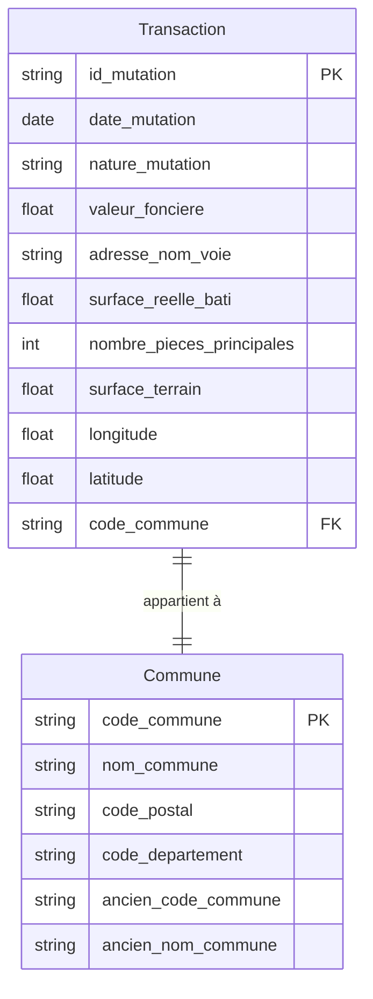

# NOTE DE CADRAGE - PROJET IMMOBILIER IA

## À remplir par le binôme

---

## 1. Informations générales

| | |
|:---|:---|
| **Titre du projet** | DEV IA Immobilier |
| **Binôme** | Étudiant 1 : Maximilien <br> Étudiant 2 : Melody |
| **Date de début** | 2026-03-09 |
| **Date de livraison** | 2026-03-16 |
| **Lien dépôt GitHub** | https://github.com/Maximilien/dev_ia_immobilier |

---

## 2. Présentation du projet

### 2.1 Objectif principal (en une phrase)

> L'objectif de ce projet est de développer un agent immobilier intelligent capable de fournir des informations précises et personnalisées sur le marché immobilier français, en s'appuyant sur des données publiques telles que les transactions immobilières (DVF) et les caractéristiques des communes, afin d'aider les utilisateurs à prendre des décisions éclairées pour leurs projets immobiliers.

### 2.2 Problématique / besoin utilisateur

> L'application permettra aux particuliers et investisseurs immobiliers d'obtenir rapidement des informations fiables sur les prix de l'immobilier, les tendances du marché, et les caractéristiques des communes (écoles, transports, commerces), afin de les aider à choisir le meilleur endroit pour acheter, louer ou investir dans l'immobilier en France. Actuellement, ces informations sont souvent dispersées et difficiles à interpréter pour les non-experts, ce qui rend la prise de décision complexe.

### 2.3 Périmètre fonctionnel

- Interface de chat / conversation
- Recherche de biens immobiliers par critères
- Estimation de prix à partir des données DVF
- Informations sur une commune (écoles, transports, commerces)
- Conseils personnalisés (investissement, achat, location)
- Historique des conversations

---

## 3. Architecture technique

### 3.1 Stack technologique choisie

| Composant | Technologie retenue | Justification |
|:---|:---|:---|
| Framework IA / Orchestration | Langchain |  |
| Modèle de langage (LLM) | | |
| Base de données | | |
| Backend / API | FastAPI | |
| Frontend / Interface | | |
| Hébergement / Déploiement | | |
| Versionnement | Git + GitHub | |

### 3.2 Sources de données externes

| Source | Données récupérées | Méthode d'accès (API directe, fichier, etc.) |
|:---|:---|:---|
| data.gouv.fr / DVF | Données de transactions immobilières | fichier |
| MCP data.gouv.fr | Données diverses sur les communes  | MCP |
| géocoding data.gouv.fr | Géocoding de localisations | API |

### 3.3 Outils / fonctions que l'agent pourra utiliser

| Nom de l'outil | Description | Source de données associée |
|:---|:---|:---|
| rechercher_prix_moyen | Calcule le prix moyen au m² dans une commune | Base PostgreSQL (données DVF) |
| obtenir_infos_commune | Récupère les informations sur les écoles, transports, commerces d'une commune | Base PostgreSQL (données MCP) |
| geocoder_localisation | Convertit une adresse en coordonnées géographiques | API de géocoding data.gouv.fr |

---

## 4. Modélisation des données

### 4.1 Structure de la base de données

```csv
id_mutation,date_mutation,numero_disposition,nature_mutation,valeur_fonciere,adresse_numero,adresse_suffixe,adresse_nom_voie,adresse_code_voie,code_postal,code_commune,nom_commune,code_departement,ancien_code_commune,ancien_nom_commune,id_parcelle,ancien_id_parcelle,numero_volume,lot1_numero,lot1_surface_carrez,lot2_numero,lot2_surface_carrez,lot3_numero,lot3_surface_carrez,lot4_numero,lot4_surface_carrez,lot5_numero,lot5_surface_carrez,nombre_lots,code_type_local,type_local,surface_reelle_bati,nombre_pieces_principales,code_nature_culture,nature_culture,code_nature_culture_speciale,nature_culture_speciale,surface_terrain,longitude,latitude
2020-1,2020-07-01,000001,Vente,31234.16,,,SAINT JULIEN,B064,01560,01367,Saint-Julien-sur-Reyssouze,01,,,013670000A0008,,,,,,,,,,,,,0,,,,,AB,terrains a b??tir,,,1192,5.109255,46.403019
2020-2,2020-07-01,000001,Vente,278000,,,A LA PEROUSE,B188,01250,01125,Corveissiat,01,,,011250000C0509,,,,,,,,,,,,,0,,,,,BS,taillis sous futaie,,,10092,5.444577,46.252372
2020-2,2020-07-01,000001,Vente,278000,,,A LA PEROUSE,B188,01250,01125,Corveissiat,01,,,011250000C0510,,,,,,,,,,,,,0,,,,,L,landes,,,4570,5.444588,46.253467
2020-2,2020-07-01,000001,Vente,278000,,,AUX COMMUNS,B079,01250,01125,Corveissiat,01,,,01125000ZL0096,,,,,,,,,,,,,0,,,,,BS,taillis sous futaie,,,5750,5.442015,46.256031
```

**Transaction**:
- Colonnes : id_mutation, date_mutation, nature_mutation, valeur_fonciere, adresse_nom_voie, surface_reelle_bati, nombre_pieces_principales, surface_terrain, longitude, latitude
- Clé primaire : id_mutation
- Relations : Commune (code_commune)

**Commune**:
- Colonnes : code_insee, nom_standard, code_postal, dep_code, niveau_equipements_services, densite, superficie_km2, altitude_moyenne, type_commune_unite_urbaine
- Clé primaire : code_commune
- Relations : Transaction (code_commune)

### 4.2 Schéma relationnel (optionnel)



---

## 5. Organisation et répartition du travail

### 5.1 Répartition des rôles

| Étudiant | Responsabilités principales |
|:---|:---|
| Maximilien | |
| Melody | |

### 5.2 Planification prévisionnelle

| Jour | Objectifs | Tâches détaillées | Responsable |
|:---|:---|:---|:---|
| Lundi | Initialisation | | |
| Mardi | Développement | | |
| Mercredi | **Jalon mi-parcours** | | |
| Jeudi | Intégration | | |
| Vendredi | Finalisation | | |

### 5.3 Outils de gestion de projet utilisés

GitHub Projects

---

## 6. Contraintes et risques identifiés

### 6.1 Contraintes techniques

*Limitations connues (API rate limits, taille des données, temps de réponse, etc.) :*


### 6.2 Risques et plans de contournement

| Risque | Probabilité (Faible/Moyenne/Élevée) | Impact | Plan B / Mitigation |
|:---|:---|:---|:---|
| API DVF indisponible | | | |
| Temps de réponse trop long | | | |
| Difficulté d'intégration du LLM | | | |
| | | | |

---

## 7. Critères de succès

### 7.1 Minimum Viable Product (MVP)

*Ce que vous considérez comme le "minimum acceptable" pour vendredi :*

- [ ] 
- [ ] 
- [ ] 

### 7.2 Fonctionnalités "nice to have" (si temps)

- [ ] 
- [ ] 
- [ ] 

---

## 8. Validation

| | Nom | Date | Signature |
|:---|:---|:---|:---|
| **Étudiant 1** | | | |
| **Étudiant 2** | | | |
| **Formateur (optionnel)** | | | |

---

## 9. Annexes

*Liens utiles, ressources, documentation, etc.*


